<table>
<tr>
<td valign="top"></td>
<td valign="top"></td>
</tr>
</table>

<h1>Antoine Guillon</h1>

<strong>Développeur · Sécurité Web · Open Source</strong>

  
  
  
  
  
  

  
  

---

## Projets

<table>
<tr>
<td width="100%">

**[🔒 env-sentinel](https://github.com/antoine-devfr/env-sentinel)** &nbsp;  

Valide tes variables d'environnement au démarrage et **échoue fort** si un secret est manquant, trop court, ou défini à une valeur faible connue (`secret`, `changeme`, `password`…). Un fichier de config, cinq langages, zéro surprise en production.

`Node.js` `Python` `Go` `PHP` `Ruby` `CLI` `Security` `DevOps`

</td>
</tr>
</table>

---

  

Les SVGs s'animent à l'ouverture du profil · Graph mis à jour automatiquement chaque jour via GitHub Actions

